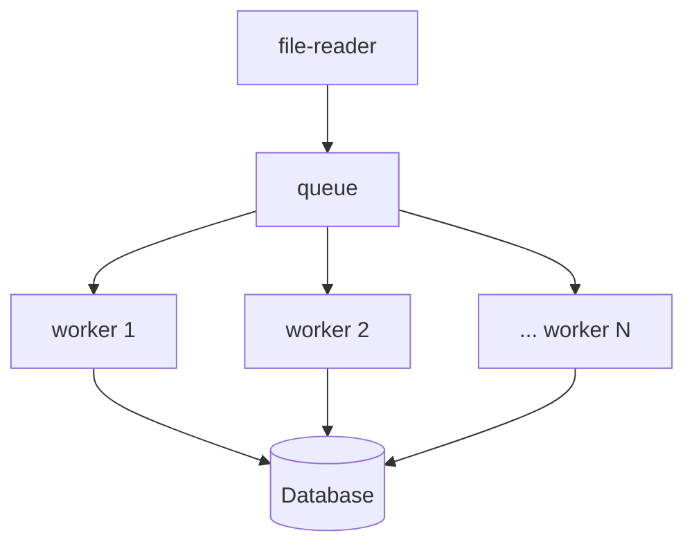

# BI5 IMPORTER
a tool for bulk importing bi5 files into sql

## PREREQUISITES
- `python3`
- `make`
- postgresql (run `make db` to get a containerised DB)
- `pg_config`

## SETUP
1. copy `.env.example` to `.env`
2. create a pg database, and configure credentials in `.env`
3. run `make setup`

## RUN
1. `source .venv/bin/activate`
2. `python bi5importer.py --path=test_data`

## TEST
code coverage:
- install the "Coverage Gutters" vscode plugin
- run `pytest --cov=src --cov-report xml:cov.xml`

## INSTALL ADDITIONAL DEPENDENCIES
1. `pip install some_new_package`
2. `pip freeze > requirements.txt`
3. commit `requirements.txt` to source control

## ADDING A DB MIGRATION
`yoyo new ./db_migrations -m "your message"`

## CONCURRENCY
1. loop over files, place them in a queue (one instrument at a time)
2. pick off queue, using a worker pool
3. save files to DB

